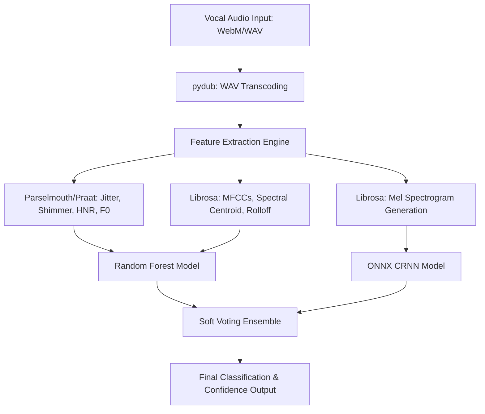

# NeuroVocal AI: Advanced Vocal Health Diagnostics Portal 🗣️

NeuroVocal AI is a digital vocal health screening platform that utilizes Machine Learning and Deep Learning to detect vocal and neurological health disorders—specifically **Parkinson’s Disease, Alzheimer's Disease, Clinical Stress, and Depression**—directly from vocal audio recordings.

This repository hosts the **Interactive User Portal** branch (`interactive-ui`), which features secure user authentication, clinical statistics, screening history tables, and database-backed persistence (SQLite locally and PostgreSQL in production).

---

## 🚀 Key Features

*   **Secure Doctor Gateway:** Fully functional login and registration portal utilizing **bcrypt** for secure cryptographic password hashing.
*   **Voice Analyzer Workspace:** In-browser high-fidelity voice recording or audio file upload (processed on-the-fly from WebM to WAV via FFmpeg and Pydub).
*   **Dual-Model Ensemble Classifier:**
    *   **Random Forest Classifier** trained on 32 high-resolution acoustic features (extracting vocal cord tremors, pitch instability, and resonance distributions).
    *   **Convolutional Recurrent Neural Network (CRNN)** processing spatial-temporal visual patterns of vocal frequencies via Mel Spectrograms.
*   **Dynamic Database Backend:** Environment-aware configurations that automatically load local **SQLite** (`database.db`) during development and seamlessly bind to **PostgreSQL** in cloud production.
*   **Highly Optimized Containerization:** Deployed using **Docker** and **ONNX Runtime** instead of full TensorFlow, dropping the server memory footprint from 450MB+ to under 80MB (making it 100% compatible with Render Free Tier limits).

---

## 🛠️ Technology Stack

*   **Frontend:** HTML5, Vanilla CSS3 (Glassmorphism, custom CSS variables, responsive design), JavaScript, Chart.js.
*   **Backend:** Flask, Flask-SQLAlchemy (ORM), Gunicorn (WSGI).
*   **Digital Signal Processing (DSP):** Librosa (Mel Spectrograms, MFCCs), Parselmouth/Praat (Jitter, Shimmer, HNR, F0 pitch, intensity).
*   **Machine Learning Runtime:** ONNX Runtime, Scikit-Learn, Joblib, Bcrypt.
*   **Infrastructure:** Docker, PostgreSQL, Render.

---

## 💻 Local Installation & Setup

Ensure you have Python 3.10+ installed on your system.

1.  **Clone the Repository:**
    ```bash
    git clone https://github.com/keerthanakulal/NeuroVocal-disease.git
    cd NeuroVocal-disease
    git checkout interactive-ui
    ```

2.  **Install System Dependencies:**
    *   *Windows:* Install FFmpeg and ensure it is added to your System PATH.
    *   *Linux (Ubuntu/Debian):*
        ```bash
        sudo apt-get update
        sudo apt-get install -y ffmpeg libsndfile1
        ```

3.  **Install Python Packages:**
    ```bash
    pip install -r requirements.txt
    ```

4.  **Run the Application:**
    ```bash
    python app_launcher.py
    ```

5.  **Open in Browser:**
    Navigate to **`http://127.0.0.1:5000`** in your web browser.

---

## 🔑 Demo Account Credentials

To test the application locally without registering a new account, you can sign in using these default credentials:
*   **Email:** `doctor@hospital.com`
*   **Password:** `password123`

*(You can also go to the **Register** tab to create a brand new personal account!)*

---

## 📐 Pipeline Architecture



---

## 📄 License

This project is developed as a final-year academic research contribution in computer science and digital health diagnostics.
