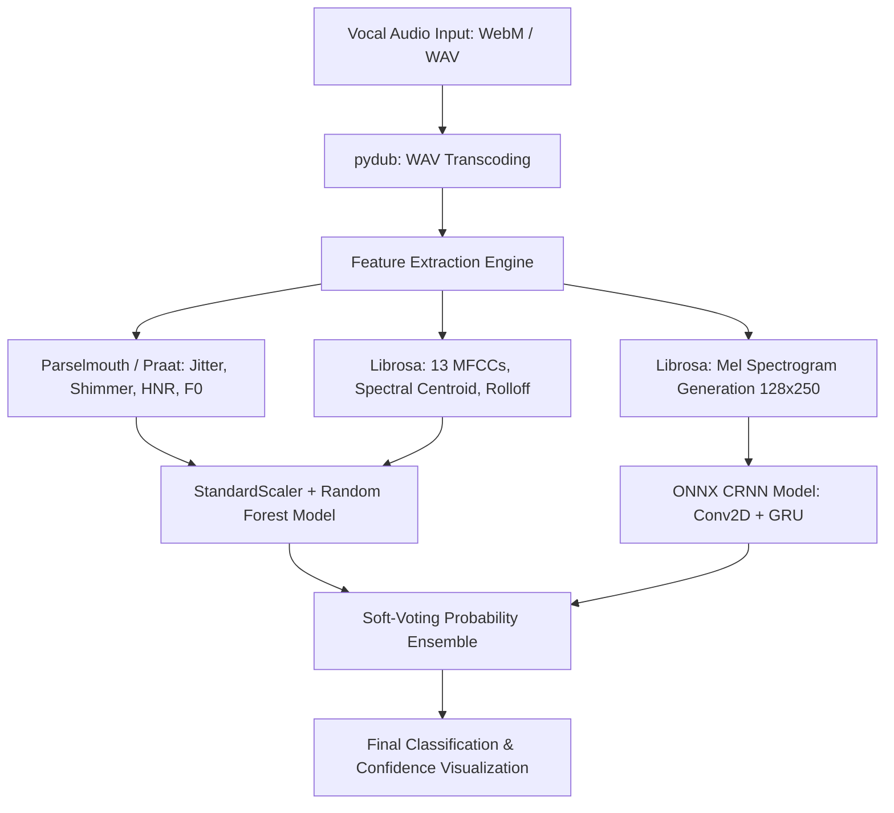

# NeuroVocal AI: Advanced Vocal Health Diagnostics Portal 🗣️

NeuroVocal AI is a digital vocal health screening platform that utilizes Machine Learning and Deep Learning to detect vocal and neurological health disorders—specifically **Parkinson’s Disease, Alzheimer's Disease, Clinical Stress, and Depression**—directly from vocal audio recordings.

---

## 🌐 Live Deployments

The project is deployed and actively running in cloud production on Render across two dedicated environments:

| Version | Description | Live URL | Branch |
| :--- | :--- | :--- | :--- |
| **v2 Interactive Portal** *(Latest)* | Multi-page diagnostics portal with doctor authentication, persistent PostgreSQL database, screening history, and disease guide decks. | 🔗 [**neurovocal-interactive.onrender.com**](https://neurovocal-interactive.onrender.com/) | [`interactive-ui`](https://github.com/keerthanakulal/NeuroVocal-disease/tree/interactive-ui) |
| **v1 Core Classifier** | Standalone vocal biomarker prediction interface for fast clinical voice screening. | 🔗 [**neurovocal-ai.onrender.com**](https://neurovocal-ai.onrender.com/) | [`main`](https://github.com/keerthanakulal/NeuroVocal-disease/tree/main) |

---

## 🚀 Key Features

*   **Secure Doctor Gateway:** Fully functional login and registration portal utilizing **bcrypt** for cryptographic password hashing.
*   **Voice Analyzer Workspace:** In-browser vocal recording or audio file upload (processed on-the-fly from WebM to raw WAV via FFmpeg and Pydub).
*   **Dual-Model Ensemble Classifier:**
    *   **Random Forest Classifier:** Trained on a 34-dimensional standardized vector of hand-crafted acoustic features (Jitter, Shimmer, HNR, F0 Mean/Std, and 13 MFCC Means & Stds).
    *   **Convolutional Recurrent Neural Network (CRNN):** Processes spatial-temporal visual patterns of vocal frequencies via 2D Mel Spectrograms ($128 \times 250 \times 1$) with stacked GRU layers.
    *   **Soft-Voting Ensemble:** Blends class probabilities for maximum stability and diagnostic accuracy.
*   **Dynamic Database Backend:** Environment-aware configurations that automatically load local **SQLite** (`database.db`) during development and seamlessly bind to cloud **PostgreSQL** in production.
*   **Highly Optimized Containerization:** Deployed using **Docker** and **ONNX Runtime** instead of full TensorFlow, reducing the server memory footprint from 450MB+ to under 80MB (making it 100% stable and fast on cloud environments).
*   **Clinical Illness Information Deck:** Detailed pathology and acoustic biomarker guides for Alzheimer's Disease, Parkinson's Disease, Clinical Stress, and Clinical Depression.

---

## 🛠️ Technology Stack

*   **Frontend:** HTML5, Vanilla CSS3 (Modern Glassmorphism, custom CSS variables, responsive mobile layout), JavaScript, Chart.js.
*   **Backend:** Flask, Flask-SQLAlchemy (ORM), Gunicorn (WSGI).
*   **Digital Signal Processing (DSP):** Librosa (Mel Spectrograms, MFCCs, Spectral Centroid, Rolloff), Parselmouth/Praat (Jitter, Shimmer, HNR, F0 pitch, intensity).
*   **Machine Learning Runtime:** ONNX Runtime, Scikit-Learn, Joblib, Bcrypt.
*   **Infrastructure & Database:** Docker, PostgreSQL, Render.

---

## 💻 Local Installation & Setup

Ensure you have Python 3.10+ installed on your system.

1.  **Clone the Repository:**
    ```bash
    git clone https://github.com/keerthanakulal/NeuroVocal-disease.git
    cd NeuroVocal-disease
    ```

2.  **Switch to the Interactive UI Branch:**
    ```bash
    git checkout interactive-ui
    ```

3.  **Install System Dependencies:**
    *   *Windows:* Install FFmpeg and ensure it is added to your System PATH.
    *   *Linux (Ubuntu/Debian):*
        ```bash
        sudo apt-get update
        sudo apt-get install -y ffmpeg libsndfile1
        ```

4.  **Install Python Packages:**
    ```bash
    pip install -r requirements.txt
    ```

5.  **Run the Application:**
    ```bash
    python app_launcher.py
    ```

6.  **Open in Browser:**
    Navigate to **`http://127.0.0.1:5000`** in your web browser.

---

## 🔑 Demo Account Credentials

To test the application locally without registering a new account, you can sign in using these pre-configured credentials:
*   **Email:** `doctor@hospital.com`
*   **Password:** `password123`

*(You can also use the **Register** tab to create a brand new account with persistent database storage!)*

---

## 📐 Pipeline Architecture



---

## 📄 Academic Context

This project is developed as a final-year academic research contribution in computer science, digital signal processing, and AI-assisted healthcare diagnostics.
